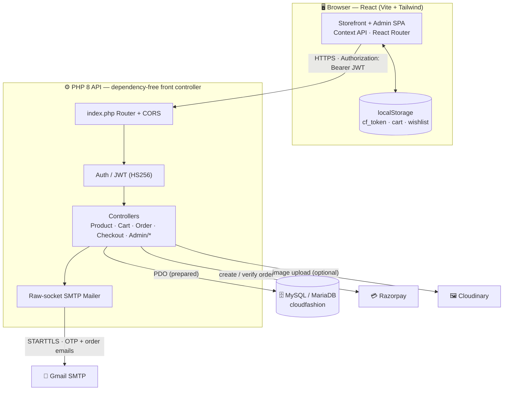
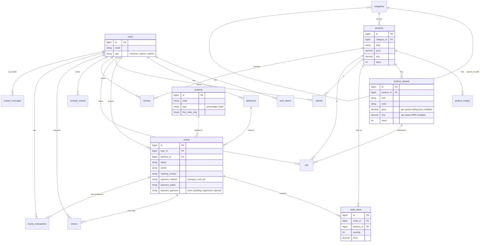
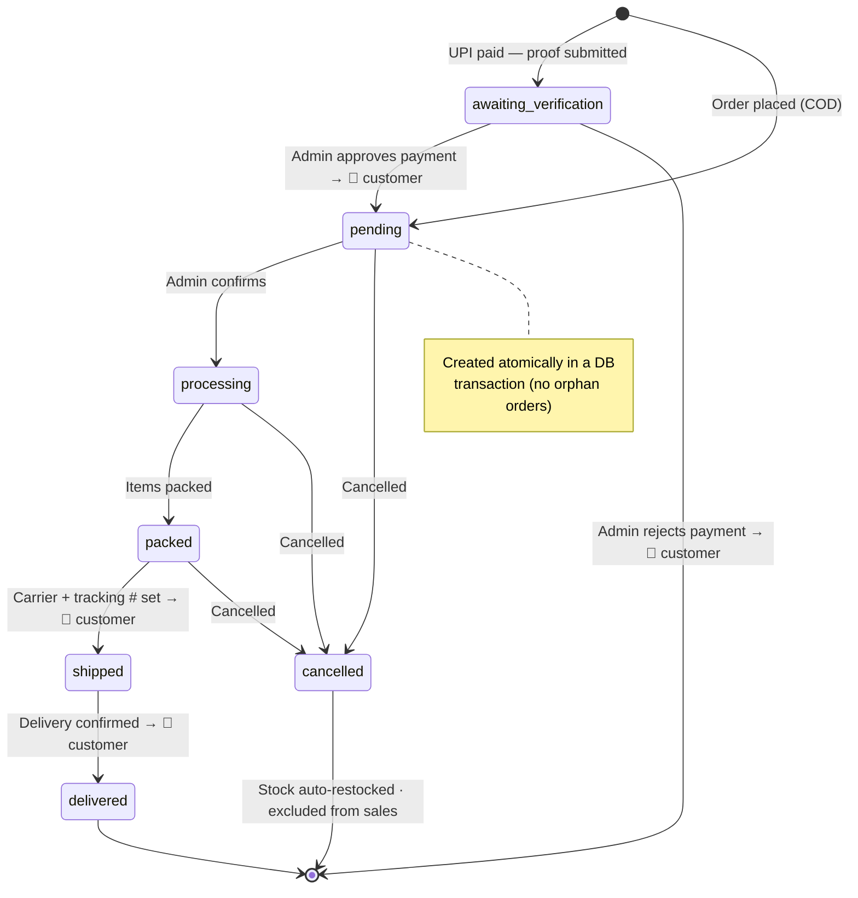
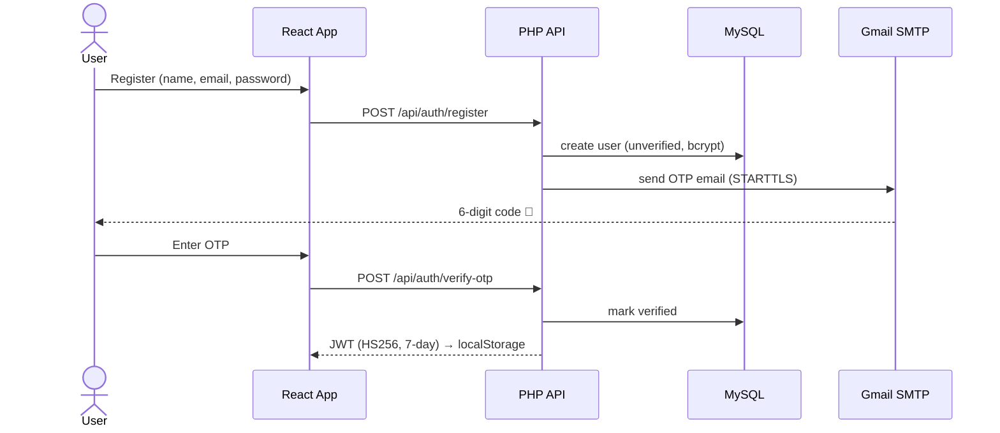
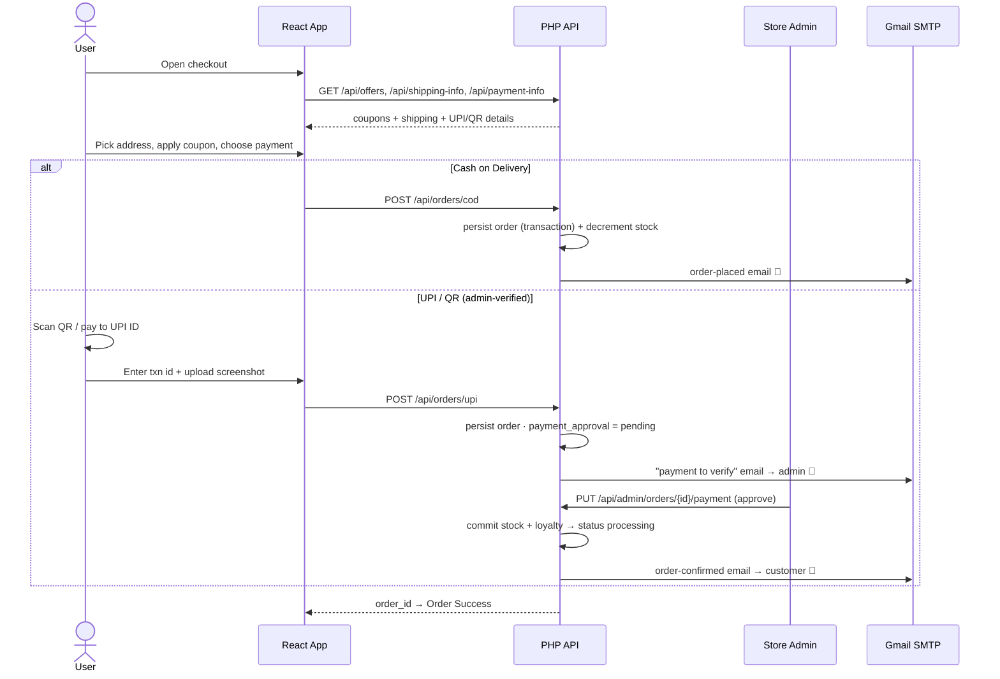

# 🐾 FURCIL — Premium Pet Store

A complete, production-ready **single-vendor pet-supplies e-commerce** web application with a premium UI — featuring a glassmorphism design, dark/light mode, full customer storefront, and a powerful admin dashboard. Sells **pet products** (food, toys, grooming, beds, habitats, health) for **dogs, cats, birds, fish & small pets** — not live animals.

**Stack:** React (Vite) + Tailwind CSS · PHP 8 (dependency-free) · MySQL/MariaDB · JWT + Email OTP + **Google Sign-In** · Cloudinary · **Razorpay (live checkout)** + **UPI/QR (admin-verified)** + COD · **Mail Automation** (lifecycle drip)

---

## 🏗️ System Architecture



---

## ✨ Features

### Customer
- **Auth** — Register, Login, Logout, **real Email OTP verification** (live Gmail SMTP), **Google Sign-In** (OAuth — find-or-create user), Forgot/Reset password (JWT-based, **7-day sliding sessions** that refresh on activity and stay logged in until manual logout)
- **Premium landing page** (`/`) — editorial, luxury storytelling built with Framer Motion + Lenis smooth-scroll: a **3D coverflow hero carousel** (admin banners), auto-sliding **category / featured-collection / "styled by you"** carousels (all live from the DB), brand-story scroll reveal, admin-editable hero & story copy + imagery, dark/light toggle, profile dropdown
- **Home** (`/home`) — Hero slider, featured categories (**live category images**), new arrivals, trending, best sellers, **admin-managed promo banners**, live **offers strip**, **"Shop the Sale"** → on-sale filter
- **Catalog** — Search, **dynamic facet filters** built from live DB data (category, brand, size, **color swatches**, price range), sort (price/popularity/newest/rating/**discount**), **on-sale** filter, pagination
- **Product page** — Image gallery with **zoom**, **Quick View** side drawer, specs, variants (size/pack/colour) with **per-size pricing** — selecting a size updates the price, MRP strike-through & discount % live from that variant, a **context-aware size guide** (weight packs → a **pack & feeding guide** built from the product's real variants; beds → dimensions; collars → neck-girth), stock, **reviews & ratings with rating breakdown**, **frequently-bought-together**, related products, **share buttons**, **"notify me when back in stock"**
- **Reviews 2.0** — Verified buyers can review **after delivery**; star rating + title + comment, per-product rating breakdown bars
- **Product comparison** — Add items to a **compare bar** and view side-by-side specs
- **Wishlist**, **Cart** (variant-aware, live totals)
- **Loyalty Points** — Earn points on every order (configurable rate + **per-order cap**); Rewards tab with balance + history *(points are no longer surfaced at checkout — the checkout is kept clean)*
- **Checkout** — Address management, **live available-coupons chips** (tap to apply), and a **total-based payment rule** — orders **up to ₹1,000** (admin-set `cod_max_amount`) may pay **Cash on Delivery** *or* online; **above ₹1,000** only **online (Razorpay)** is offered, enforced on the server. Options: **Razorpay** (Card/UPI/Netbanking) · **UPI/QR** (admin-verified) · **COD**
  - **UPI / QR payment (no gateway needed)** — "Pay Online" shows a **scannable UPI QR** (auto-generated with the exact amount) + UPI ID / bank details on the left, and on the right the customer's auto-filled name/phone, a **transaction-ID** field and a **payment-screenshot** upload; the order is placed as **"awaiting verification"** and confirmed once an **admin approves** the payment (stock committed + confirmation email). Admin gets an email the moment a payment is submitted.
  - **Smart shipping** — first order ships **free**; repeat orders free above the (admin-set) threshold, else a flat fee
  - **First-order-only coupons** (e.g. `WELCOME10`) validated against order history
  - Atomic order creation (DB transaction — no orphan orders on failure)
- **Orders** — History, detail with status timeline, **shipment tracking** (carrier + tracking #), **Reorder**, cancel & auto-restock, **post-delivery reviews**, **Returns/Refund requests (RMA)**, **print invoice** (with a delivery-verification QR)
- **Order emails** — Order-placed confirmation + status-update + **return-status** emails
- **Profile** — Edit details, change password, manage addresses, **Rewards** (mobile-friendly tabbed layout)
- Recently viewed, newsletter, **working contact form** (saved to DB + emailed), About/Privacy/Terms pages
- **Floating WhatsApp button**, **mobile bottom tab bar (PWA-style)**
- **Responsive** + **Dark/Light mode** + smooth Framer Motion animations + **PWA manifest**

### Admin
- **Dashboard** — KPI cards (today's sales, pending orders, avg order value, new customers…), a **sales-by-channel** row (online vs in-store counter), revenue chart, color-coded order-status chart, top products & recent customers widgets, manual **Refresh**
  - **Combined revenue** — online orders **+** in-store billing counter sales; cancelled orders excluded (only `paid` & non-cancelled count)
- **Billing / POS** — in-store checkout counter: live product search + **QR/barcode scan**, cart with per-order discount (₹ or %) and configurable **tax/GST**, **cash / UPI / card / split** payment (split = part cash + part card/UPI, validated to cover the total) with change calc, optional customer (earns loyalty), **printable thermal invoice** (80mm, monospace, store **logo** header), bill **history + void & restock**; every sale decrements the same live stock as online orders
- **Invoices** — one unified list of **every sale** — online orders **+** counter bills — newest first, with channel filter (All / Online / Counter), KPIs, and **view + print** for each (thermal receipt for counter, A4 invoice for online), auto-refreshing; every printed online invoice carries a **delivery-verification QR** — scanning it opens a **public verify page** that confirms the order & its items **live from the DB** (signed token, tamper-proof)
- **Cashiers** — create billing-counter staff logins (`cashier` role) that can access **only** the billing screen; block/unblock, reset password, per-cashier sales totals
- **Notifications** — Bell with live alerts, **mark read/unread**, **delete**, **mark-all-read**
- **Products** — Full CRUD, multiple images (Cloudinary or inline base64), **variants with a direct per-size Price ₹ + MRP ₹ table** (manual absolute rate per size/pack, own stock; empty falls back to the base price/MRP), specifications, **bulk CSV import** (auto-creates categories)
- **Categories** (clean auto-slugs), **Coupons** (percentage/fixed, min order, expiry, usage limit, **first-order-only**, **edit** support)
- **Banners** — CRUD for homepage hero/promo banners
- **Orders** — Filter by status, update lifecycle (pending → processing → packed → shipped → delivered / cancelled), set **carrier + tracking number**, **"Save & notify"** emails the customer; a **Payment Approvals** queue (badge count) surfaces UPI orders awaiting verification — open the proof (transaction id + screenshot) and **approve** (confirms the order, commits stock, emails the customer) or **reject** (emails the reason)
- **Categories** — CRUD with **image upload** (Cloudinary or inline), shown live on the storefront
- **Inventory** — Low-stock & out-of-stock alerts, stock editing
- **Customers** — List with spend, order history drill-down, **export** the list to **CSV / Excel / PDF**
- **Reviews** — Moderate customer reviews (hide/unhide, delete) with live rating recalculation
- **Returns** — Approve/reject RMA requests → auto-restock + refund status + customer email
- **Loyalty** — Per-customer point balances, KPIs (issued/redeemed/outstanding), transaction history, **manual credit/deduct**, and editable **program rules** (earn rate, per-order cap, ₹ per point, redeem cap)
- **Mail Automation** — a **lifecycle email drip** anchored to order events: order-confirmation (on placement) → **welcome** + **feeding guide** (on delivery) → **check-in** (+14 days) → **review request with referral code** (+20 days) → **reorder reminder** (+27 days). Each step's **enable toggle + offset days** are admin-editable; a **live queue log** (recipient · type · scheduled · status) + KPIs (sent/pending/due/failed) and a **"Run due now"** button. Sends via the real SMTP mailer; a token-protected **`/api/cron/run`** lets Windows Task Scheduler / cron drive it hands-free (migration 032)
- **Messages** — Inbox for Contact Us submissions with unread badge, mark read/unread, one-click email reply
- **Store Settings** — Edit store name, public contact details, message inbox, **announcement bar**, **free-shipping threshold + flat fee**, **social links & WhatsApp**, **order number prefix** + **COD threshold** (`cod_max_amount`), and the **online-payment details** (UPI ID, payee, optional custom QR image, bank account/IFSC) — all live on the storefront in real time
- **Reports** — Date-range filter + presets, KPI cards (incl. **online vs counter revenue**), charts (daily revenue, orders by status, revenue by category, payment methods) — **all combine online + in-store billing** — CSV export, **Refresh** (revenue excludes cancelled)
- **Product QR labels** — generate & print scannable QR stickers (encode the product URL) for the counter scanner: a single product, **N copies** of one product, or **all products on one sheet** (bulk)
- **Storefront scope** — an optional `storefront_category` setting can limit the whole storefront (listings, collections, filters, product pages, nav & footer categories) to one category + its children; **currently empty = all pet categories shown** (Dogs, Cats, Birds, Fish, Small Pets…). Set it to a category slug to run a single-category store
- **Store Settings → Brand** — upload a **store logo** + edit the store name; both go live everywhere (header, footer, admin, emails, invoices, thermal receipts) in real time
- **Account dropdown** (Profile / Settings / Change Password / Logout), **static/sticky sidebar**, brand logo across all pages

---

## 📁 Project Structure

```
FURCIL/
├── database/
│   ├── cloudfashion.sql          # Full schema + seed data (DB name kept: cloudfashion)
│   ├── migration_002…024.sql     # Incremental schema updates (see Migrations)
│   ├── migration_025…029.sql     # Pet-store rebrand: catalogue, banners, category/product restores
│   ├── migration_030…031.sql     # Per-variant absolute price + per-variant MRP
│   ├── migration_032_mail_automation.sql   # Lifecycle email drip queue + settings
│   └── migration_033_order_prefix.sql      # Sequential FUR#### order numbers
├── backend/                      # PHP API (front-controller, no Composer needed)
│   ├── bootstrap.php             # Loads env, core, autoloader
│   ├── index.php                 # Router + CORS
│   ├── routes.php                # All route definitions
│   ├── .env.example
│   ├── config/                   # env loader, PDO database
│   ├── core/                     # Response, Request, Jwt, Validator, Auth, Mailer, Cloudinary, Razorpay
│   └── controllers/              # Auth, Product, Cart, Order, Checkout, … + admin/
└── frontend/                     # React + Vite + Tailwind
    ├── src/
    │   ├── api/client.js          # Axios instance (JWT interceptor)
    │   ├── context/               # Auth, Cart, Wishlist, Theme, Compare, Store
    │   ├── components/            # Navbar (DB-driven categories), Footer, ProductCard, CompareBar, …
    │   ├── pages/                 # Home, Shop, ProductDetails, Cart, Checkout, Orders, Compare, VerifyOrder, auth/, static/
    │   └── admin/                 # AdminLayout, Dashboard, AdminProducts, AdminBilling, AdminInvoices, AdminReviews, AdminReturns, AdminLoyalty, AdminSettings, …
    └── tailwind.config.js
```

---

## 🗄️ Database Tables

**Core schema** (`cloudfashion.sql`):
`users`, `auth_tokens`, `categories`, `products`, `product_images`, `product_variants`,
`addresses`, `wishlist`, `cart`, `coupons`, `orders`, `order_items`, `reviews`,
`recently_viewed`, `newsletter`.

**Added by migrations:**
`banners`, `stock_notifications`, `notification_states`, `returns`,
`loyalty_transactions`, `settings`, `contact_messages`, **`bills`, `bill_items`**
(in-store billing/POS), **`email_automations`** (lifecycle mail drip queue) — plus new columns
(`reviews.is_hidden`; `users.loyalty_points/referral_code/referred_by`;
`orders.points_used/points_earned`; `orders.status` `returned` state;
**`users.role` gains `cashier`**).

### Entity-Relationship Diagram



### Migrations (apply in order, after the base schema)

| File | What it does |
|------|--------------|
| `migration_002.sql` | `banners` + `stock_notifications` tables |
| `migration_003.sql` | `notification_states` (admin read/dismiss state for alerts) |
| `migration_004.sql` | Widen `product_images` / `categories` / `banners` image columns to `MEDIUMTEXT` (inline base64 images) |
| `migration_005.sql` | `coupons.first_order_only` flag; sets `WELCOME10` first-order-only |
| `migration_006.sql` | `orders.carrier` + `orders.tracking_number` (shipment tracking) |
| `migration_007.sql` | Widen `order_items.image_url` to `MEDIUMTEXT` |
| `migration_008.sql` | `reviews.is_hidden` (admin review moderation) |
| `migration_009.sql` | `returns` table + `orders.status` `returned` state |
| `migration_010.sql` | Loyalty: `users.loyalty_points/referral_code/referred_by`, `orders.points_used/points_earned`, `loyalty_transactions` table |
| `migration_011.sql` | Add `adjust` type to `loyalty_transactions` (admin manual adjustments) |
| `migration_012.sql` | `settings` key/value table + seeded loyalty rules (incl. per-order earn cap) |
| `migration_013.sql` | `loyalty_point_value` setting (configurable ₹ value per point) |
| `migration_014.sql` | `contact_messages` table (Contact Us inbox) |
| `migration_015.sql` | Store contact settings (email, phone, address, inbox) |
| `migration_016.sql` | Store settings: name, announcement, free-shipping threshold, socials, WhatsApp |
| `migration_017.sql` | Landing hero + brand-story copy settings (admin-editable) |
| `migration_018.sql` | Landing image settings (hero / collections / new-arrival) |
| `migration_019.sql` | Widen `settings.value` to `MEDIUMTEXT` (inline base64 logo/images) |
| `migration_020.sql` | **Billing / POS** — `bills` + `bill_items` tables + billing settings (tax %, invoice prefix, footer) |
| `migration_021.sql` | **Cashier role** — `users.role` gains `cashier` (billing-counter staff) |
| `migration_022.sql` | **Split payment** — replaces billing `other` method with `split` (`split_cash` + `split_digital`) |
| `migration_023.sql` | **Storefront scope** — `storefront_category` setting limits the storefront to one category + children (optional single-category mode; empty = show all) |
| `migration_024.sql` | **UPI / QR payment** — adds `upi` to `orders.payment_method` + proof/approval columns (`payment_txn_id`, `payment_screenshot`, `payment_approval`, `payment_note`, `payment_reviewed_at`) and UPI/bank payee settings |
| `migration_025_petshop.sql` | **Pet-store rebrand** — clears the clothing catalogue and seeds pet categories (Dogs, Cats, Birds, Fish, Small Pets) + products/images/variants; rebrands `settings` (store name, hero copy, announcement) to FURCIL; clears `storefront_category` (show all) |
| `migration_026_pet_banners.sql` | Replaces clothing hero banners with pet banners (Dogs/Cats/Birds/Fish/Small Pets) |
| `migration_027…028` | Non-destructive **restore** of pet categories + products (slug-keyed, idempotent) |
| `migration_029_petcare_wellness_products.sql` | Seeds products into admin-created **Pet Care** & **Pet Wellness** categories |
| `migration_030_variant_price.sql` | **Per-variant price** — `product_variants.price` (absolute manual selling price per size/pack; `NULL` keeps the legacy base + `price_diff`) |
| `migration_031_variant_mrp.sql` | **Per-variant MRP** — `product_variants.mrp` (own strike-through price + discount % per size/pack; `NULL` uses the product base MRP) |
| `migration_032_mail_automation.sql` | **Mail Automation** — `email_automations` queue table (order_id, type, scheduled_at, sent_at, status) + seeded drip config settings (`automation_*_enabled/offset`) |
| `migration_033_order_prefix.sql` | **Sequential order numbers** — seeds `order_prefix` (default `FUR`); new orders become `FUR00001`, `FUR00002`… (also seeds `cod_max_amount` COD threshold) |

```bash
# apply every migration in order (phpMyAdmin or CLI)
for f in database/migration_*.sql; do mysql -u root -p cloudfashion < "$f"; done
```

---

## 🚀 Quick Start (XAMPP — Windows)

> Prerequisites: XAMPP (Apache + MySQL/MariaDB, PHP 8.1+), Node.js 18+.

### 1. Database
Start **Apache** and **MySQL** in the XAMPP Control Panel, then import the schema:

```bash
# from the project root
mysql -u root -p < database/cloudfashion.sql
# …or import database/cloudfashion.sql via phpMyAdmin (http://localhost/phpmyadmin)
```

This creates the `cloudfashion` database with sample products, categories, and two accounts:

| Role     | Email                       | Password   |
|----------|-----------------------------|------------|
| Admin    | `admin@furcil.com`    | `Admin@123`|
| Customer | `customer@furcil.com` | `Test@123` |

### 2. Backend
The project lives in `htdocs`, so Apache serves it automatically.

```bash
cd backend
cp .env.example .env          # then edit DB_PASS, JWT_SECRET, keys
```

API base URL: **`http://localhost/furcil/backend`** (the `FURCIL™` folder, reached via a clean `/furcil` path)
Test it: open `http://localhost/furcil/backend/api/categories` → `{"success":true,...}`

> **Clean `/furcil` path:** because the folder name is `FURCIL™` (the ™ is bad in URLs), a **filesystem symlink** `htdocs/furcil → htdocs/FURCIL™` exposes it at `/furcil` (Apache serves it through `DocumentRoot` + `FollowSymLinks` — no alias/vhost config needed). Recreate it with `mklink /D` (Windows) or `ln -s` if it's missing. The backend router derives its mount point dynamically, so the app also works if you serve the folder directly.

> **Security:** the app folder sits under the web root, so `.htaccess` files (in `FURCIL™/` and `backend/`) block direct HTTP access to secrets and internals — `.env`, `*.log`, `*.sql`, dot-files and `backend/storage/` all return **403**. Keep these in place.

> The backend is **dependency-free** — no Composer required. JWT, Cloudinary, Razorpay,
> and SMTP are all implemented with native PHP + cURL.

### 3. Frontend

```bash
cd frontend
npm install
npm run dev        # http://localhost:5190 (port pinned via strictPort)
```

`frontend/.env`:
```
VITE_API_URL=http://localhost/furcil/backend
```

---

## 🔑 Configuration

Edit `backend/.env`:

| Variable | Purpose |
|---|---|
| `DB_*` | MySQL connection (default user `root`) |
| `JWT_SECRET` | **Change this** — signs all auth tokens |
| `MAIL_DRIVER` | `smtp` sends **real email** (OTP + order emails); `log` writes to `backend/storage/mail.log` |
| `SMTP_*` | SMTP creds — for Gmail use a 16-char **App Password** (not your account password) when `MAIL_DRIVER=smtp` |

> **Email is live:** with `MAIL_DRIVER=smtp` and a Gmail App Password, OTP verification and
> order confirmation / status-update emails are sent for real over STARTTLS (raw-socket mailer,
> no PHPMailer dependency). Keep your App Password out of any public commit — rotate it if leaked.
| `CLOUDINARY_*` | Image uploads (optional — falls back to provided URLs) |
| `RAZORPAY_*` | Payment gateway — **now wired into checkout** (Card/UPI/Netbanking). Empty keys = **test mode** (order placed, no real charge). See **[RAZORPAY_SETUP.md](RAZORPAY_SETUP.md)** for the full step-by-step key setup |
| `GOOGLE_CLIENT_ID` | Google Sign-In (optional). Must match `VITE_GOOGLE_CLIENT_ID` in `frontend/.env`. Without it the button shows a "not configured" message |
| `CRON_KEY` | Shared secret for the token-gated mail-automation runner. Point Windows Task Scheduler / cron at `…/api/cron/run?key=CRON_KEY` (e.g. every 15 min). Empty = the cron endpoint is disabled; use the admin **Run due now** button instead |

> **Google Sign-In:** create an OAuth 2.0 **Web** client in Google Cloud Console, add your
> frontend origin (e.g. `http://localhost:5190`) to *Authorized JavaScript origins*, and paste the
> Client ID into **both** `backend/.env` (`GOOGLE_CLIENT_ID`) and `frontend/.env`
> (`VITE_GOOGLE_CLIENT_ID`). The backend verifies the token's `aud` before creating/linking the user.

> **Store settings are admin-editable:** contact details, the announcement bar, free-shipping
> threshold/fee, social links, WhatsApp number and all loyalty rules live in the `settings` table
> and are edited from **Admin → Settings / Loyalty** — no redeploy needed.

### Graceful fallbacks (so the app works out-of-the-box)
- **No SMTP?** OTP & reset emails are written to `backend/storage/mail.log`.
- **No Cloudinary?** Image URLs you paste are stored directly.
- **No Razorpay?** Checkout runs in test mode and completes the order so the full flow is demoable.

---

## 🔌 API Overview

All responses follow `{ success, message, data }`. Protected routes need
`Authorization: Bearer <jwt>`. See **[backend/API.md](backend/API.md)** for the full reference.

```
POST   /api/auth/register            POST   /api/auth/verify-otp
POST   /api/auth/login               POST   /api/auth/forgot-password
POST   /api/auth/google              GET    /api/auth/me   (sliding session)
GET    /api/products?search=&sort=   GET    /api/products/{slug}
GET    /api/products/filters         GET    /api/products/{slug}/frequently-bought
GET    /api/categories               POST   /api/cart
GET    /api/offers                   POST   /api/coupons/apply
GET    /api/shipping-info            POST   /api/notify-stock
GET    /api/store-info               POST   /api/contact
GET    /api/payment-info             (UPI id / payee / QR / bank details)
GET    /api/loyalty                  POST   /api/reviews
POST   /api/checkout/create-order    POST   /api/checkout/verify
POST   /api/orders/cod               POST   /api/orders/upi   (submit txn id + screenshot)
POST   /api/orders/{id}/reorder      PUT    /api/orders/{id}/cancel
GET    /api/orders                   POST   /api/orders/{id}/return
GET    /api/orders/verify/{id}?t=    (public — invoice QR delivery verification)
GET    /api/cron/run?key=            (public, token-gated — runs the mail-automation drip)

GET    /api/categories/{slug}/thumb  GET    /api/products/{id}/thumb   (cached image passthrough)

# admin (Authorization: Bearer <admin jwt>)
GET    /api/admin/dashboard          GET    /api/admin/notifications
POST   /api/admin/products           POST   /api/admin/products/import   (bulk CSV)
GET    /api/admin/categories         (full, unscoped list for admin)
PUT    /api/admin/orders/{id}/status (carrier + tracking, emails customer)
GET    /api/admin/orders/{id}/payment PUT   /api/admin/orders/{id}/payment (UPI proof · approve/reject)
GET    /api/admin/invoices           GET    /api/admin/invoices/order/{id}  (unified sales)
GET    /api/admin/reports/sales?from=&to=   (online + counter combined)
CRUD   /api/admin/banners            CRUD   /api/admin/coupons
GET/PUT/DELETE /api/admin/reviews    GET/PUT /api/admin/returns
GET    /api/admin/loyalty            PUT    /api/admin/loyalty/settings
POST   /api/admin/loyalty/{id}/adjust
GET    /api/admin/automation         PUT    /api/admin/automation   (drip config)
POST   /api/admin/automation/run     (process due emails now)
GET/PUT/DELETE /api/admin/messages   GET/PUT /api/admin/settings
CRUD   /api/admin/staff              (cashier accounts)

# billing / POS  (Authorization: Bearer <admin OR cashier jwt>)
GET    /api/admin/billing/config     GET    /api/admin/billing/products?q=
GET    /api/admin/billing/lookup?code=   (resolve scanned QR/barcode)
GET    /api/admin/billing/customer-lookup?phone=   (link a returning customer)
GET    /api/admin/billing            POST   /api/admin/billing         (create bill; split payment supported)
GET    /api/admin/billing/{id}       PUT    /api/admin/billing/{id}/void
```

---

## 🔄 Key Flows

### Order lifecycle



### Auth + OTP (registration)



### Checkout → Order



---

## 🛠️ Tech Notes
- **State management:** React Context API (Auth, Cart, Wishlist, Theme)
- **Routing:** React Router v6 with protected & admin-only routes
- **Charts:** Recharts · **Animations:** Framer Motion · **Icons:** Lucide
- **Security:** bcrypt password hashing, HS256 JWT, prepared statements (PDO), input validation, CORS, user-enumeration-safe password reset

See **[DEPLOYMENT.md](DEPLOYMENT.md)** for production deployment.

---

## 🆕 What's New (post-launch updates)

### 🐾 Latest wave — mail automation, sequential order numbers & a total-based payment rule
- **Mail Automation drip** — a full lifecycle email sequence anchored to order events: order-confirmation (on placement) → **welcome** + **product feeding guide** (on delivery) → **2-week check-in** → **review request with the customer's referral code** (+20 days) → **reorder reminder** (+27 days). New **Admin → Automation** console: per-step enable toggle + offset-days, KPIs (sent/pending/due/failed), a **live queue log**, and a **Run due now** button. A token-gated **`/api/cron/run?key=`** endpoint lets Windows Task Scheduler / cron send due mail hands-free. Sends through the real SMTP mailer (migration 032, `email_automations` table).
- **Sequential order numbers** — online orders switched from the random `CF……` format to clean, brand-prefixed **`FUR00001`, `FUR00002`…** generated race-safely inside the order transaction. Prefix is admin-editable (`order_prefix`); existing demo orders were renumbered in place (migration 033).
- **Total-based payment rule** — orders **up to `cod_max_amount` (₹1,000)** may pay **COD or online**; **above it, only Razorpay** is offered. Enforced on both the checkout UI and the server (COD/UPI/create-order endpoints). Threshold is admin-editable in **Settings → Orders & payment rules**.
- **Checkout de-cluttered** — loyalty **points redemption + "you'll earn" prompts removed from checkout** (points still earn/track in the background & Rewards tab).
- **Live login imagery** — the auth page's side panel now pulls **real brand banners + product images from the DB** (was hardcoded placeholders); the landing footer's social links are now **live from Store Settings** too.
- **SMTP + Cloudinary verified live** — Gmail App-Password SMTP and Cloudinary upload were tested end-to-end; `MAIL_DRIVER` flipped to `smtp` and `JWT_SECRET` rotated to a strong random value.

### 🐾 Earlier wave — per-size pricing, smarter size guide & hardened serving
- **Per-size Price + MRP** — each variant (size/pack) now carries its **own absolute selling price and MRP**, entered directly in a Price ₹ / MRP ₹ table in the admin product form (no more "+₹ difference" maths). The storefront (product page **and** Quick View) shows the selected size's price, strike-through MRP and discount % **live from the DB**; empty fields fall back to the product base price/MRP. Backed by `migration_030` (`product_variants.price`) + `migration_031` (`product_variants.mrp`).
- **Context-aware size guide** — the Size Guide modal now reads the product's **real variant sizes** and category: weight packs (g/kg/ml) show a **Pack & Feeding Guide** listing the actual packs + a feeding-by-weight table; beds show dimensions; collars/harnesses show neck-girth. No more collar chart on a food tub.
- **Hardened serving** — the `/furcil` path is a **filesystem symlink** (not an Apache alias — corrected here), and `.htaccess` rules now return **403** for `.env`, logs, SQL dumps, dot-files and `backend/storage/`, so secrets aren't web-readable under the shared `htdocs` root. All keys (DB, JWT, SMTP, Cloudinary, Razorpay) live in one `backend/.env`; edits need an Apache restart.
- **Landing polish** — headline mask-reveal made reliable (was leaving invisible-but-space-reserving headings), tighter section spacing, and 3D tilt on the editorial imagery.

### 🐾 Earlier wave — Pet-store rebrand (FURCIL) + live Razorpay checkout
- **Rebranded from a clothing store (Novo Clothing) to a pet-supplies store (FURCIL)** — brand name, logo, theme colours (logo-derived **forest green + gold + cream**), landing/hero copy, size guide (collar/bed sizing), static pages, SEO, PWA manifest and service worker all updated. The store sells **pet products, not live animals**.
- **Pet catalogue** — categories (Dogs, Cats, Birds, Fish, Small Pets) + products, images, variants seeded via `migration_025–029`; hero **banners** rebranded to pet (`migration_026`). `storefront_category` cleared so **all categories show**.
- **Razorpay live checkout** — the gateway is now **wired into the frontend Checkout** (Card / UPI / Netbanking / Wallet): create-order → hosted modal → server-side signature verify → order confirmed. Falls back to **test mode** when keys are empty. Setup guide: **[RAZORPAY_SETUP.md](RAZORPAY_SETUP.md)**.
- **Clean `/furcil` URL** — a filesystem **symlink** (`htdocs/furcil → htdocs/FURCIL™`) serves the folder at `/furcil` (avoids the ™ in URLs, no Apache alias/vhost needed); the API base and backend router derive the mount point dynamically.
- **Admin tidy-up** — sidebar trimmed (Billing / Loyalty / Cashiers removed), **Settings** tab added; themed native `<select>` dropdowns; product form labels pet-ified; category-create empty-`parent_id` bug fixed.
- **Demo logins** rebranded to `admin@furcil.com` / `customer@furcil.com` (passwords unchanged).

### Earlier wave — UPI/QR online payment, admin verification, invoice QR & customer export
- **Invoice delivery-verification QR** — every printed online invoice now carries a QR that encodes a **signed link**; scanning it opens a **public verify page** (`/verify-order/:id`) showing the order, items, ship-to and status **live from the DB** so a courier can confirm the parcel. Token is an HMAC of the order id + number — tamper-proof, no enumeration. Backed by public `GET /api/orders/verify/{id}`.
- **UPI / QR online payment (no gateway required)** — "Pay Online" now shows a **scannable UPI QR** encoding the exact amount, plus UPI ID and bank details. The customer enters the **transaction id** and uploads a **payment screenshot**; the order is placed as **"awaiting verification"** (migration 024). Backed by `GET /api/payment-info` + `POST /api/orders/upi`.
- **Admin payment approval** — a **Payment Approvals** queue in Admin → Orders (with a live badge) shows the proof (txn id + screenshot); **Approve** confirms the order (commits stock + loyalty, emails the customer), **Reject** emails the reason. The store admin is emailed the moment a payment is submitted. (`GET`/`PUT /api/admin/orders/{id}/payment`.)
- **Configurable payee** — UPI ID, payee name, an optional **custom QR image**, and bank account/IFSC live in Admin → Settings (empty UPI ID disables online payment, leaving COD).
- **Customers export** — download the customer list as **CSV / Excel / PDF** from Admin → Customers.
- **Men-only landing + subtle 3D** — the landing page drops the Women/Kids blocks (men-only store) and adds tasteful **3D tilt** on category cards, the collection showcase and product cards.

### Earlier wave — men-only store, split payment, unified invoices & thermal receipts
- **Split payment** at the counter — settle a bill part **cash** + part **card/UPI**; the server validates the two portions cover the total and stores the breakdown, which prints on the receipt. (Replaces the old "other" method — migration 022.)
- **Unified Invoices page** (Admin → Invoices) — **every sale in one place**: online orders **+** counter bills, newest first, with channel filter, KPIs, and view/print per row (thermal for counter, A4 for online).
- **Men-only storefront scope** — a `storefront_category` setting (migration 023) limits the entire storefront to one category + children; nav and footer categories are DB-driven and follow automatically. Non-men products stay in the DB, manageable in admin and sellable at the counter.
- **Redesigned thermal receipt** — authentic 80mm monospace layout with the **store logo** header, dashed separators, item count, split breakdown and cut line.
- **Bulk / multi-copy QR labels** — print **all products on one sheet**, or **N copies** of a single product's label.
- **Referral programme removed** — loyalty **points** stay; referral codes / signup & referral bonuses were retired.
- **Brand → Novo Clothing** — renamed everywhere (DB, emails, SEO, PWA, receipts); mega-menu dropped in favour of DB-driven nav; footer shop links are now live from categories.

### Earlier wave — in-store billing, cashiers & a premium landing page
- **Billing / POS counter** — a full in-store checkout: live product search + **QR/barcode scan**, discount (₹/%), configurable **tax/GST**, cash/UPI/card payment with change, optional customer (earns loyalty), **printable invoice**, and bill **history + void & restock**. Sales decrement the **same live inventory** as online orders.
- **Cashier role** — admin creates billing-counter logins that can reach **only** the POS screen; per-cashier sales, block/unblock, password reset.
- **Dashboard & Reports now combine channels** — every revenue figure, chart, top-product and category breakdown merges **online orders + in-store bills**; new online-vs-counter KPIs.
- **Product QR labels** — generate & print a scannable QR per product for the counter scanner.
- **Premium landing page** (`/`) — Awwwards-style editorial experience: **3D coverflow hero** (admin banners) + auto-sliding **category / featured / styled-by-you** carousels, all live from the DB; admin-editable hero & story copy + imagery; dark/light + profile dropdown.
- **Brand control** — store renamed to **Novo Clothing**; upload a **store logo** from Admin → Settings → Brand and it goes live everywhere (header, footer, admin, emails, invoices) in real time.
- **Lighter media** — category & product images stream through a **cached passthrough endpoint** instead of shipping multi-MB base64 in list responses.

### Earlier wave — engagement, retention & store control
- **Loyalty points** — earn points per order (admin-set rate + **per-order cap**), **redeem at checkout** with a configurable **₹ value per point**, customer **Rewards** tab, and an admin **Loyalty** console (balances, KPIs, history, manual adjust, editable rules). *(A referral programme shipped in this wave but was later removed — see the latest wave.)*
- **Returns & Refunds (RMA)** — request returns on delivered orders; admin approve/reject → auto-restock + refund status + customer email
- **Reviews 2.0** — verified **post-delivery** reviews, rating breakdown, admin **moderation** (hide/delete with live rating recalc)
- **Smart discovery** — **frequently-bought-together**, **trending / best-seller** badges, **product comparison** bar & page
- **Google Sign-In** — OAuth find-or-create, issuing the same app JWT
- **Working contact form** — saved to DB + emailed (reply-to customer); admin **Messages** inbox
- **Store Settings** — admin-editable store name, contact details, **announcement bar**, **free-shipping threshold/fee**, **socials & WhatsApp**, all live on the storefront via a shared `Store` context
- **Dynamic catalog** — sidebar facets (size/color/price) built from live DB data, **on-sale** filter & **"Shop the Sale"**, live **category images**, **category image upload**
- **UX** — admin **account dropdown**, mobile-friendly **Profile tabs** + Rewards, "Back to home" on auth pages, password **strength meter** + match check on register

### Earlier updates

**Storefront**
- Real **email OTP** via Gmail SMTP; **7-day login sessions** (no more frequent auto-logout)
- **Quick View** drawer, **size-guide** modal, **share buttons**, **back-in-stock** notify
- **Live offers strip** + checkout **coupon chips**; **first-order-only** coupons
- **Smart shipping** — free first order, then free over ₹1,999 (else ₹79)
- **Reorder** from order history; **shipment tracking** (carrier + tracking #)
- **Order emails** (placed / processing / packed / shipped / delivered)
- **WhatsApp** floating button, **mobile tab bar**, **PWA manifest**, brand logo everywhere

**Admin**
- **Notifications** with read/unread, delete, mark-all-read
- **Bulk product CSV import** (auto-creates categories); clean category slugs
- **Coupon edit**; **Banners** CRUD; themed checkboxes
- **Enriched dashboard** (8 KPIs, widgets) and **reports** (date range, more charts, CSV export)
- **Sales exclude cancelled orders**; order workflow emails the customer on status change

**Reliability**
- **Atomic order creation** (DB transaction — no orphan orders)
- Image columns widened to `MEDIUMTEXT` for inline base64 images
- Smarter 401 handling — only logs out on genuinely expired/invalid tokens

---

## 📄 License
MIT — built as a complete reference implementation for FURCIL (pet store).
